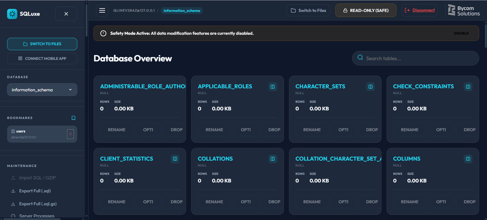
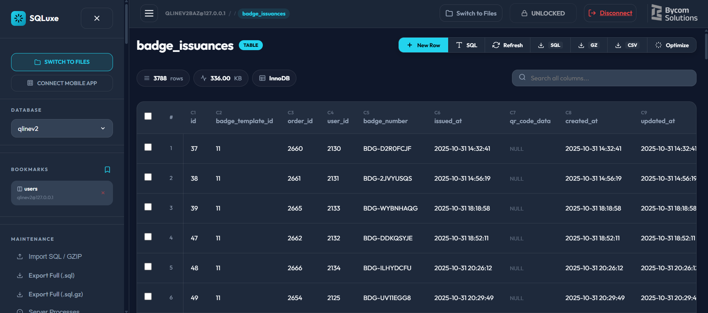
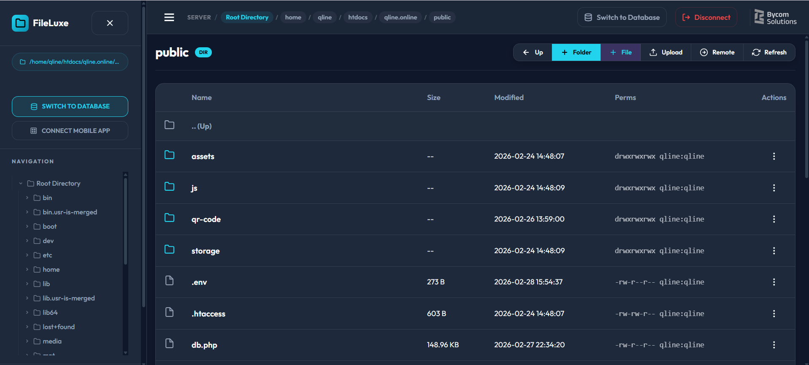
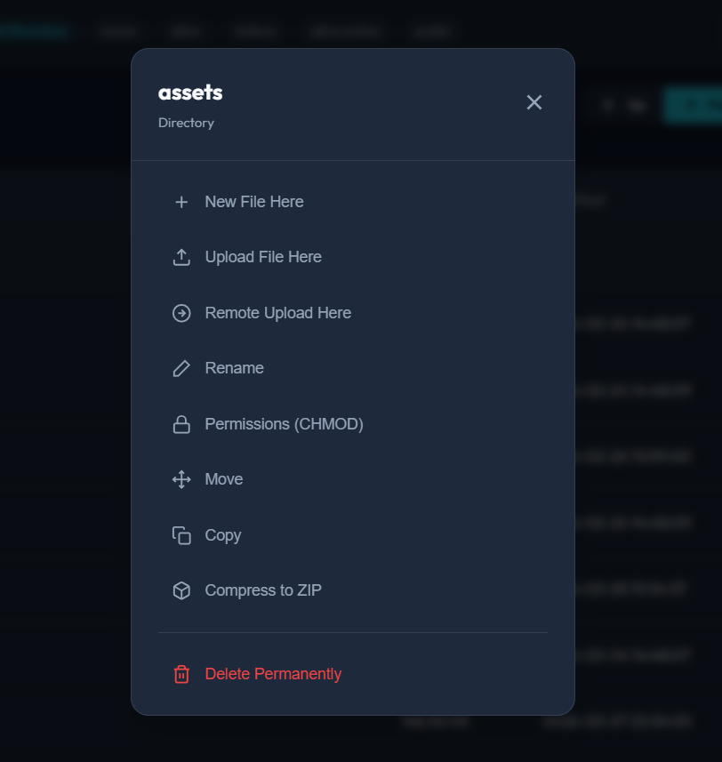

# ServerLuxe 🚀

A **lightweight, single-file suite** of server management tools designed for modern web applications. Get professional-grade database and file management with **zero dependencies**, beautiful UI, and mobile-first design.

<div align="center">


[🎯 Features](#features) • [📸 Gallery](#gallery) • [📱 Mobile App](#mobile-app) • [⚙️ Modules](#modules) • [🚀 Quick Start](#quick-start) • [📚 Build Guide](#build-documentation) • [🛡️ Security](#security) • [📄 License](#license)

</div>

---

## ✨ Features

- **Zero Dependencies** - Single PHP files, no complex framework dependencies. Just drop and run.
- **Beautiful UI/UX** - Glassmorphism design, dark mode optimized, smooth animations, mobile-first responsive layout
- **RESTful API** - Native API endpoints for headless management, custom integrations, and mobile app connections
- **Secure by Default** - Password hashing (bcrypt), API key authentication, CSRF protection, session management, path traversal prevention
- **Cross-Platform Ready** - Works on desktop browsers AND native Android/iOS apps via Capacitor
- **Real-time Operations** - Fast file browsing, instant database queries, live status monitoring
- **Mobile Optimization** - Full-featured native Android app with multi-node support, encrypted credentials storage

---

## 📸 Gallery

<div align="center">
  <h3>SQLuxe - Database Management</h3>
  
  <p><em>Modern database dashboard with real-time stats and query builder</em></p>
  
  <br/>
  
  
  <p><em>Clean, intuitive table data management with cloud-like UI</em></p>
  
  <br/>
  <hr width="50%"/>
  <br/>
  
  <h3>FileLuxe - File Management</h3>
  
  <p><em>Lightning-fast file explorer with glassmorphism design</em></p>
  
  <br/>
  
  
  <p><em>Powerful contextual actions for remote files and directories</em></p>
</div>

---

## �📱 Mobile App

### Android App (Available on Google Play)

ServerLuxe includes a **native Android app** built with Capacitor for a true native experience.

#### Why Use the Mobile App?
- ✅ **Native Performance** - Instant navigation, hardware back button support
- ✅ **Multi-Node Management** - Save multiple server connections on your device
- ✅ **Offline-Ready** - Access your last known state even with intermittent connectivity
- ✅ **Secure Storage** - API keys encrypted on device, never exposed
- ✅ **Full Feature Parity** - Everything available on web, optimized for mobile

#### Getting Started with Android App
1. Download from [Google Play Store](https://play.google.com/store/apps/details?id=com.bycomsolutions.bazilbycom.serverluxe.github) (coming soon)
2. Launch app and tap the **Grid Icon** (top right) → **+ NEW NODE**
3. Enter:
   - **Node Name**: e.g., "Production Server"
   - **Server URL**: Full URL to your `db.php` or `fm.php` (e.g., `https://example.com/admin/db.php`)
   - **API Key**: The key defined in your `.env` file (default: `2026`)
4. Tap **CONNECT** and start managing!

#### iOS App (Build It Yourself)
iOS version is available as **open-source code** - you can build it yourself using Xcode. See the [iOS Build Guide](#ios-build-guide) below.

---

## ⚙️ Modules

### 1. **SQLuxe** - Database Manager (`db.php`)

A feature-rich MySQL database management tool in a single file.

#### Features:
- 🔗 **Multi-Database Support** - Connect to multiple databases, bookmark your favorites
- 📊 **Query Builder** - Intuitive UI for viewing, searching, editing, inserting, and deleting rows
- 💻 **SQL Console** - Execute custom SQL with query history and snippet saving
- ⚡ **Server Status** - Real-time process monitoring, server performance metrics
- 📥 **Export** - Native SQL export, Gzip compression, CSV dataset export
- 🔐 **Secure** - API key authentication, password hashing, CSRF protection, session timeout

#### Quick Example:
```bash
# Upload db.php to your server
scp server/db.php user@example.com:/var/www/html/admin/

# Access in browser
https://example.com/admin/db.php

# Use API (with API key)
curl -X POST https://example.com/admin/db.php \
  -H "X-API-KEY: 2026" \
  -d "action=get_databases"
```

---

### 2. **FileLuxe** - File Manager (`fm.php`)

A sleek, fast file system manager in a single PHP file.

#### Features:
- 📁 **File Browsing** - Navigate your entire filesystem with a beautiful UI
- ✏️ **Code Editor** - Inline editor for quick remote debugging (syntax highlighting)
- 📝 **File Operations** - Create, rename, delete, move files and folders
- 🔒 **Permissions** - Modify file permissions (CHMOD) directly from the UI
- 📦 **Compression** - Bulk ZIP archive creation for easy backups
- 📤 **Upload** - Drag-and-drop file upload with validation
- 🌐 **Remote Fetch** - Download files from external URLs directly to your server
- 🛡️ **Security** - Path traversal prevention, file type validation, rate limiting

#### Quick Example:
```bash
# Upload fm.php to your server
scp server/fm.php user@example.com:/var/www/html/admin/

# Access in browser
https://example.com/admin/fm.php

# Use API (with API key)
curl -X POST https://example.com/admin/fm.php \
  -H "X-API-KEY: 2026" \
  -d "action=read&file=config.php"
```

---

## 🚀 Quick Start

### Prerequisites
- Web server running PHP 5.6+ (Apache, Nginx, etc.)
- MySQL/MariaDB (for database management features)
- Modern web browser (Chrome, Firefox, Safari, Edge)
- For mobile: Android device or iOS device

### Installation (Web UI)

1. **Download the files**
   ```bash
   git clone https://github.com/yourusername/mysqlweb.git
   cd mysqlweb/server
   ```

2. **Upload to your server**
   ```bash
   scp db.php fm.php user@example.com:/var/www/html/admin/
   ```

3. **Configure Environment**
   - **⚠️ IMPORTANT**: Copy `.env.example` to `.env` and **fill in the real values**:
   ```bash
   cp .env.example .env
   # Edit .env with your actual database credentials and secure passwords
   ```

   Example `.env` file:
   ```ini
   # ServerLuxe Configuration
   APP_NAME=ServerLuxe
   APP_ENV=production
   VERSION=1.1.0

   # Database Connection Defaults
   DEFAULT_HOST=127.0.0.1
   DEFAULT_PORT=3306
   DEFAULT_USER=root
   DEFAULT_PASS=password

   # Security
   MASTER_PASS=Bycom@22945        # Master password (auto-hashed)
   API_KEY=2026                    # API authentication key

   # Navigation
   DB_FILE=db.php
   FM_FILE=fm.php
   ```

   **Security Note**: Never commit `.env` to version control. Always use `.env.example` as a template and fill in your actual credentials locally.

4. **Access in browser**
   - Database Manager: `https://yourdomain.com/admin/db.php`
   - File Manager: `https://yourdomain.com/admin/fm.php`

5. **Login**
   - Password: Use `MASTER_PASS` from `.env` (or default configuration)
   - API Key (mobile/API): Use `API_KEY` from `.env`

### Installation (Mobile App)

1. Download from Google Play (link coming soon)
2. Or build from source (see [Build Documentation](#build-documentation))
3. Launch app and add your server nodes (see [Mobile App](#mobile-app) section)

---

## 📚 Build Documentation

### Android Build Guide

#### Prerequisites
- **Node.js** v14+ and npm
- **Java Development Kit (JDK)** 11+ (for Gradle)
- **Android SDK** (API level 34 recommended)
- **Android Studio** installed and configured with an emulator or physical device

#### Build & Deploy Steps

1. **Setup Environment**
   ```bash
   # Clone the repository
   git clone https://github.com/yourusername/mysqlweb.git
   cd mysqlweb/app

   # Install dependencies
   npm install
   ```

2. **Sync Web Assets**
   ```bash
   # Initialize Android platform (first time only)
   npx cap add android

   # Sync web code to Android project
   npx cap sync android
   ```

3. **Open in Android Studio**
   ```bash
   # Open the Android project in Android Studio
   npx cap open android
   ```

4. **Build and Run**
   - In Android Studio, select your target device/emulator
   - Click **Run** button or press `Shift+F10`
   - App will build and install automatically

#### Development Workflow

When you modify files in `www/` (HTML, CSS, JavaScript):

```bash
# Just copy the changes to Android
npx cap copy android

# Then run in Android Studio
```

#### Preparing for Google Play Release

1. **Update App Version**
   - Edit `app/android/app/build.gradle`:
     ```gradle
     android {
         defaultConfig {
             versionCode 2          // Increment for each release
             versionName "1.1"      // Update version
         }
     }
     ```

2. **Create Release Keystore**
   ```bash
   # Generate keystore (do this once, keep it safe!)
   keytool -genkey -v -keystore serverluxe-release.keystore \
     -keyalg RSA -keysize 2048 -validity 10000 \
     -alias serverluxe
   ```

3. **Configure Signing**
   - Add to `app/android/app/build.gradle`:
     ```gradle
     signingConfigs {
         release {
             storeFile file('serverluxe-release.keystore')
             storePassword 'your_password'
             keyAlias 'serverluxe'
             keyPassword 'your_password'
         }
     }

     buildTypes {
         release {
             signingConfig signingConfigs.release
             minifyEnabled false
         }
     }
     ```

4. **Build Release APK**
   ```bash
   cd android
   ./gradlew assembleRelease

   # APK will be at: app/build/outputs/apk/release/app-release.apk
   ```

5. **Upload to Google Play**
   - Go to [Google Play Console](https://play.google.com/console)
   - Create new app or select existing
   - Upload APK to internal testing → beta testing → production
   - Fill in store listing, screenshots, privacy policy
   - Submit for review

#### Technical Details
- **Minimum SDK**: API 22 (Android 5.1)
- **Target SDK**: API 34 (Android 14)
- **Compile SDK**: API 34
- **Gradle Version**: 8.2.1
- **Capacitor Version**: 5.0.0

---

### iOS Build Guide

#### Prerequisites
- **Mac with Xcode** 14+ installed
- **CocoaPods** package manager
- **Apple Developer Account** (for App Store distribution)
- **Node.js** v14+ and npm

#### Build & Deploy Steps

1. **Setup Environment**
   ```bash
   # Clone the repository
   git clone https://github.com/yourusername/mysqlweb.git
   cd mysqlweb/app

   # Install dependencies
   npm install
   ```

2. **Initialize iOS Platform**
   ```bash
   # Add iOS platform (first time only)
   npx cap add ios

   # Sync web code to iOS project
   npx cap sync ios
   ```

3. **Open in Xcode**
   ```bash
   # Open the iOS project in Xcode
   npx cap open ios
   ```

4. **Configure App Settings**
   - In Xcode, select the **ServerLuxe** target
   - Go to **General** tab:
     - Set **Team** to your Apple Developer team
     - Set **Bundle Identifier** (e.g., `com.youcompany.serverluxe`)
     - Set **Version** and **Build** numbers
   - Go to **Signing & Capabilities**:
     - Enable **Automatically manage signing** (recommended)

5. **Build and Run**
   - Select your target device or simulator
   - Click **Play** button or press `Cmd+R`
   - App will build and run on your device

#### Development Workflow

When you modify files in `www/`:

```bash
# Copy changes to iOS
npx cap copy ios

# Rebuild in Xcode (Cmd+B)
```

#### Preparing for App Store Release

1. **Update App Version**
   - In Xcode, select **ServerLuxe** target
   - Go to **General** tab
   - Update **Version** and **Build** numbers

2. **Create App Store Connect Entry**
   - Go to [App Store Connect](https://appstoreconnect.apple.com)
   - Create new app or select existing
   - Fill in app information, screenshots, description

3. **Create App Store Distribution Certificate**
   - In Xcode: **Preferences** → **Accounts** → Select your account
   - Click **Manage Certificates**
   - Create "Apple Distribution" certificate if not exists

4. **Create Provisioning Profile**
   - In Apple Developer portal, create App Store provisioning profile
   - Download and install in Xcode

5. **Archive and Upload**
   - In Xcode: **Product** → **Archive**
   - Click **Distribute App**
   - Select **App Store Connect**
   - Follow upload wizard to submit to App Store

#### Technical Details
- **Minimum iOS Version**: 13.0+
- **Capacitor Version**: 5.0.0
- **Framework**: UIKit-based
- **Architecture**: arm64, arm64e

---

## 🛡️ Security

### Built-in Security Features

1. **Password Hashing** - Master password auto-hashed with bcrypt on first login
2. **API Key Authentication** - Secure API key validation for mobile/API clients
3. **CSRF Protection** - Session tokens prevent cross-site request forgery
4. **Path Traversal Prevention** - All file operations validated against traversal attacks
5. **Session Management** - Automatic 30-minute idle timeout, session regeneration
6. **File Upload Validation** - Filename sanitization, dangerous file type blocking
7. **CORS Validation** - Strict origin checking, Capacitor support
8. **Rate Limiting** - Login attempt throttling (5 attempts per 15 minutes)
9. **Error Reporting** - Production mode disables debug errors, logs securely
10. **SSRF Protection** - Remote URL validation, internal IP blocking

### Security Best Practices

1. **Change Default Password** - Update `MASTER_PASS` in `.env` immediately
2. **Use HTTPS** - Always access via HTTPS in production
3. **Restrict File Access** - Place files outside web root if possible, use `.htaccess` to restrict access
4. **Keep API Key Secret** - Don't hardcode in client-side code, store in `.env`
5. **Enable Production Mode** - Set `APP_ENV=production` in `.env` to disable debug output
6. **Regular Updates** - Check for security patches and updates regularly
7. **Monitor Access** - Review server logs for suspicious activity
8. **Backup Credentials** - Store keystore file safely for app updates

### Reporting Security Issues

Found a security vulnerability? Please report privately to: [security@bycomsolutions.com](mailto:security@bycomsolutions.com)

---

## 📋 Features Roadmap

### ✅ Completed
- ✅ Single-file database manager (db.php)
- ✅ Single-file file manager (fm.php)
- ✅ Beautiful glassmorphism UI with dark mode
- ✅ RESTful API with key authentication
- ✅ Native Android app (Capacitor)
- ✅ Comprehensive security hardening
- ✅ Session management and timeouts
- ✅ Multi-node support in mobile app
- ✅ File upload with validation
- ✅ SQL console with history
- ✅ Code editor with syntax highlighting

### 🚀 Planned (Roadmap)
- 📅 iOS app on App Store
- 📅 Web-based documentation/wiki
- 📅 User management and roles
- 📅 Advanced scheduling (backup jobs, cleanup tasks)
- 📅 Real-time collaboration (multi-user sessions)
- 📅 Database replication support
- 📅 Webhook integrations
- 📅 Advanced analytics and monitoring dashboard
- 📅 Encrypted backups to cloud storage
- 📅 Command palette for quick actions
- 📅 Plugin system for custom tools

### 💡 Under Consideration
- Dark theme variants
- Custom styling/branding options
- Database diff/migration tools
- GraphQL API support
- Terraform provider integration
- Database performance tuning recommendations

---

## 🎯 Use Cases

- **Development** - Quick database inspection during development
- **System Administration** - Remote file management without SSH
- **DevOps** - Server state verification, quick configuration changes
- **Client Work** - Give clients safe, limited access to their data
- **Emergency Response** - Fast troubleshooting without complex tooling
- **Learning** - Study how web apps manage databases and files
- **Startups** - Lightweight, zero-dependency solution for young companies

---

## 📁 Project Structure

```
mysqlweb/
├── server/                 # Server-side PHP files
│   ├── db.php             # SQLuxe - Database Manager
│   ├── fm.php             # FileLuxe - File Manager
│   └── .env               # Configuration file
├── app/                    # Mobile app (Capacitor)
│   ├── www/               # Web assets
│   │   ├── index.html     # Database Manager UI
│   │   ├── fm.html        # File Manager UI
│   │   ├── ui.js          # Shared UI components
│   │   └── styles/        # CSS styling
│   ├── android/           # Android native code
│   ├── package.json       # Node dependencies
│   └── capacitor.config.json
└── README.md              # This file
```

---

## 🤝 Contributing

Contributions are welcome! Here's how to help:

1. **Report Issues** - Found a bug? Open an issue with details
2. **Suggest Features** - Have an idea? Start a discussion
3. **Improve Docs** - Help make documentation clearer
4. **Submit PRs** - Code improvements? Submit a pull request

---

## 💬 Support

- **Documentation**: Check the [Build Documentation](#build-documentation) section
- **FAQ**: Common questions answered in issues
- **Community**: Join discussions for tips and tricks
- **Email**: support@bycomsolutions.com

---

## 📄 License

MIT License - Free for personal and commercial use. See LICENSE file for details.

---

## 🙏 Acknowledgments

- Built with ❤️ by **[Bycom Solutions](https://bycomsolutions.com)**
- Powered by [Capacitor](https://capacitorjs.com/) for cross-platform mobile
- Beautiful UI with [Alpine.js](https://alpinejs.dev/)
- Icons by community designers

---

## 📊 Stats

- **Lines of Code**: ~3,800 (highly optimized)
- **Dependencies**: 0 for PHP files, minimal for mobile
- **Bundle Size**: ~50KB gzipped (web assets)
- **Supported Browsers**: All modern browsers
- **Supported PHP**: 5.6+ (tested on 7.2+)
- **Mobile**: Android 5.1+, iOS 13.0+

---

<div align="center">

**Made with 💙 by [Bycom Solutions](https://bycomsolutions.com)**

[⬆ Back to top](#serverluxe-)

</div>
